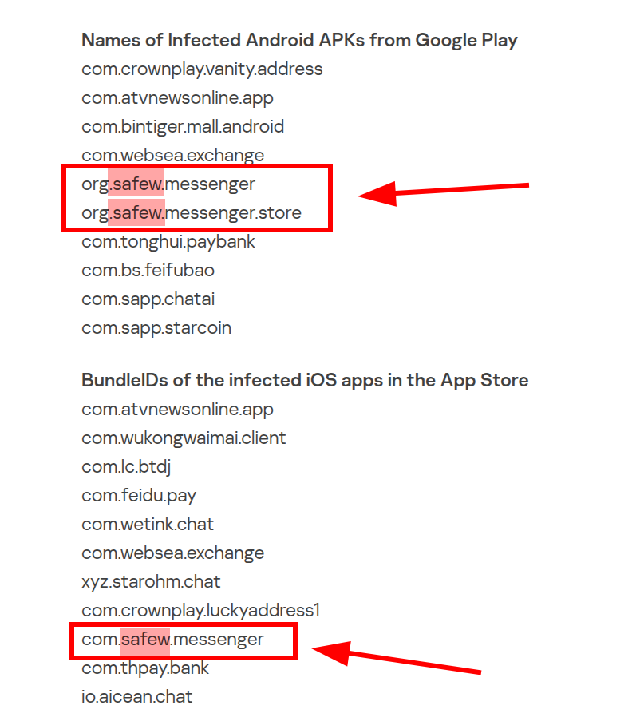
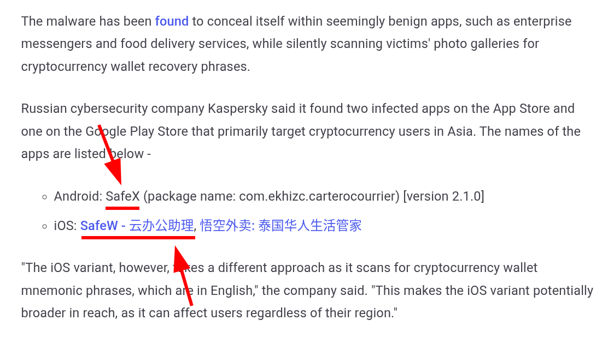
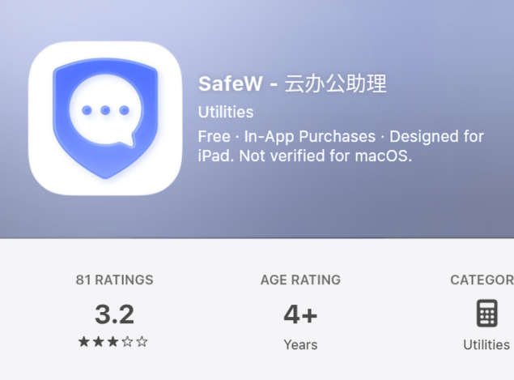

# SafeW / SafeX Evidence

本仓库整理 SafeW / SafeX 相关公开证据：被点名的应用标识、原始安全报告、截图、PDF 摘要与文件 hash。

重点给中文用户核对三个问题：

1. 被公开报告点名的是否是 SafeW / SafeX 相关应用。
2. 被点名的包名 / Bundle ID 是什么。
3. SafeW 下架、改名 SafeX、再次被点名的过程是否有公开来源。

## 快速结论

公开来源显示，SafeW / SafeX 与安全行业命名为 SparkCat 的窃密恶意软件有关联。相关报告描述的手法包括申请图库权限、使用 OCR 扫描相册图片、识别加密钱包恢复短语 / 助记词 / 私钥 / 密码，并上传命中的图片。

如果你已经安装过 SafeW 或 SafeX，并且曾把钱包助记词、私钥、密码、2FA 备份码等截图保存在相册中，应按“可能已泄露”处理。自救步骤见：

- https://nosafew.com/remove/

## 关键应用标识

| 平台 | 名称 / 说明 | 包名 / Bundle ID |
| --- | --- | --- |
| Android | SafeW | `org.safew.messenger` |
| Android | SafeW | `org.safew.messenger.store` |
| iOS | SafeW | `com.safew.messenger` |
| Android | SafeX | `com.ekhizc.carterocourrier` |

## 仓库文件

| 文件 | 内容 |
| --- | --- |
| `packages.md` | 包名与核对说明 |
| `sources.md` | 原始来源链接 |
| `archive-links.md` | 存档与失效链接 |
| `screenshots/README.md` | 截图说明 |
| `hashes.md` | 截图与 PDF 的 SHA256 |
| `reports/SafeW_SafeX_安全调查报告.pdf` | 中文整理版 PDF |

## 主要截图

### Kaspersky Securelist 截图

### The Hacker News 截图

### App Store SafeW 截图

## 相关站点

- Website: https://nosafew.com/
- Evidence page: https://nosafew.com/evidence/
- Malware explainer: https://nosafew.com/sparkcat/
- Self-help guide: https://nosafew.com/remove/

## 说明

本仓库尽量使用谨慎表述：凡属公开报告直接支持的内容，标记为“公开来源显示”；凡属从多个公开记录得出的判断，标记为“推断”。欢迎补充来源，但不接受私人信息、骚扰或无法核对的指控。
